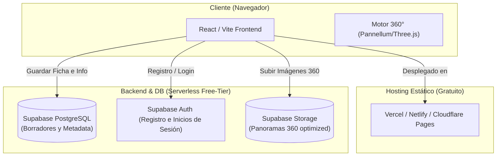

# Propuesta Técnica y Arquitectura de Escalabilidad Proptech

Este documento detalla el análisis de ingeniería y las mejoras estratégicas recomendadas para potenciar el **Centro de Operaciones Inmobiliarias (`composer.html`)**. El enfoque está dividido en dos fases: **Fase Local** (optimización del flujo de trabajo actual gratuito y offline) y **Fase SaaS** (escalado a una aplicación distribuida para múltiples usuarios).

---

## 🛠️ Fase 1: Optimización Local (Localhost / Uso Personal)

Para elevar la experiencia de usuario y la eficiencia al crear decenas de inmuebles de forma continua, proponemos integrar las siguientes tecnologías libres en el archivo HTML autocontenido:

### 1. Persistencia de Datos con IndexedDB (Auto-Guardado Local)
- **Problema actual:** Si el navegador se cierra o se refresca la página, los datos temporales del inmueble en memoria se pierden.
- **Solución:** Integrar **IndexedDB** (la base de datos integrada de los navegadores). Esto permite guardar borradores de múltiples propiedades con sus imágenes 360 directamente en el almacenamiento persistente del navegador del usuario.
- **Beneficio:** Panel de *"Mis Inmuebles Guardados"* para editar, duplicar o retomar proyectos antiguos en cualquier momento, 100% offline y con coste $0.

### 2. Compresor de Imágenes Integrado (Canvas API)
- **Problema actual:** Las imágenes 360° crudas tomadas por cámaras profesionales suelen pesar entre 8MB y 20MB. Al convertirlas a Base64, el tamaño aumenta un 33%, resultando en archivos HTML finales muy pesados para enviar por WhatsApp.
- **Solución:** Implementar un script de compresión al vuelo usando el **Canvas API de HTML5** antes de la conversión a Base64. Al importar una foto, el navegador la redimensionará (ej. a un máximo de 6000x3000px) y la comprimirá a formato WebP con calidad 80%.
- **Beneficio:** Reducción del tamaño del HTML final de 15MB a menos de **1.5MB** sin pérdida perceptible de nitidez visual, acelerando la descarga y el envío por chat.

### 3. Aplicación Web Progresiva (PWA - Modo Offline)
- **Solución:** Añadir un archivo `manifest.json` y un *Service Worker* básico.
- **Beneficio:** El usuario podrá "instalar" la herramienta en su PC o teléfono móvil como si fuera una app nativa, funcionando perfectamente en zonas sin cobertura de internet (durante visitas de campo a terrenos o fincas).

---

## 🚀 Fase 2: Escalado a Aplicación Pública (SaaS)

Si decides comercializar esta herramienta o permitir que tu equipo de agentes inmobiliarios colabore en la misma plataforma, la arquitectura debe migrar a un modelo cliente-servidor estructurado. Proponemos un **Stack Proptech 100% Serverless y Gratuito (Free-Tier)**:

### Componentes de la Arquitectura Escalable:

| Componente | Tecnología Propuesta | Rol en la Aplicación | Coste Inicial |
| :--- | :--- | :--- | :--- |
| **Frontend** | React + Vite + TypeScript | Interfaz reactiva y panel de control para múltiples usuarios. | **$0** (Vercel / Netlify / Cloudflare Pages) |
| **Base de Datos** | PostgreSQL (Supabase) | Almacenamiento de usuarios, fichas de inmuebles y coordenadas de hotspots. | **$0** (Free Tier de Supabase - hasta 500MB) |
| **Autenticación** | Supabase Auth | Registro de agentes con email/contraseña u OAuth (Google). | **$0** (Hasta 50,000 usuarios activos al mes) |
| **Almacenamiento** | Supabase Storage (S3) | Alojamiento de imágenes 360° optimizadas y vídeos de drone. | **$0** (Free Tier de Supabase - 1GB de almacenamiento) |
| **CDN & Resizer** | Cloudflare Images / Workers | Transforma imágenes 360° dinámicamente según la pantalla del cliente. | **$0** (Free Tier de Cloudflare Workers) |

---

## 💡 Recomendaciones de Vanguardia (Futuro del Proyecto)

1. **Migración a Three.js / React Three Fiber (R3F):**
   - *Por qué:* Pannellum es ideal para panorámicas simples de 360°, pero limitado para añadir elementos 3D. Migrar a Three.js te permitirá cargar modelos de planos 3D (BIM), simular iluminación solar dinámica o colocar muebles virtuales (*virtual staging*) sobre las fotos panorámicas.
2. **Generador de Copys Inmobiliarios con Inteligencia Artificial:**
   - *Cómo:* Integrar el SDK de Google Gemini (Free Tier) o ejecutar modelos locales ligeros en el navegador usando **WebLLM/WebGPU**. El agente solo introduce características básicas (3 hab, piscina, garaje) y la IA redacta la descripción comercial optimizada para SEO de inmediato.
3. **Integración de Radar en Tiempo Real en Plano 2D:**
   - *Cómo:* Dibujar un marcador de cono visual sobre el plano 2D de la propiedad que rote dinámicamente en respuesta al movimiento de la cámara del cliente. Esto ayuda al comprador a no perder el sentido de la orientación espacial dentro de casas grandes.
